# Frequency mixer Project

## Introduction

This python notebook implements a frequency based image fusion system to combine high-frequency features (fine details) from a cat image with low-frequency features (overall structure) from a dog image . The project uses the 2D Discrete Fourier Transform to analyze spatial frequencies, visualize magnitude spectra, study rotation effects, and fuse images using a frequency mixer. I explored multiple filtering approaches, with the Gaussian filter providing the best result due to its smooth frequency separation.

## Mathematical Info: 2D DFT (DISCREET FOURIER TRANSFORM)

The 2D DFT for an image $ I(x, y) $ of size $ M \times N $ is given by:

$$
F(u, v) = \sum_{x=0}^{M-1} \sum_{y=0}^{N-1} I(x, y) \cdot e^{-j2\pi \left( \frac{ux}{M} + \frac{vy}{N} \right)}
$$

The inverse transform is:

$$
I(x, y) = \frac{1}{MN} \sum_{u=0}^{M-1} \sum_{v=0}^{N-1} F(u, v) \cdot e^{j2\pi \left( \frac{ux}{M} + \frac{vy}{N} \right)}
$$

The magnitude spectrum is:

$$
S(u, v) = |F(u, v)|
$$

The dB spectrum is:

$$
S_{dB}(u, v) = 20 \log_{10} (|F(u, v)| + \epsilon)
$$

where $$ ( \epsilon ) $$ is a small constant to avoid log(0).

## Steps

1. **Load and Preprocess the Images**:
   - Load grayscale images using PIL.
   - Display the cat image.

2. **Compute 2D DFT and Magnitude Spectra**:
   - Apply `np.fft.fft2` to compute the 2D DFT of the cat image.
   - Shift the spectrum using `np.fft.fftshift` to center low frequencies.
   - Compute and display normal and dB magnitude spectra.

3. **Analyze Rotation Effects**:
   - Rotate the cat image $90^\circ$ counterclockwise using `np.rot90`.
   - Compute the 2D DFT and magnitude spectra of the rotated image.
   - Display spectra, observing a $90^\circ$ rotation in the frequency domain.

4. **Frequency Mixer**:
   - Fuse high frequencies (details) from the cat image with low frequencies (structure) from the dog image.
   - Tested square, circular, and bilateral filters for fusion, noting artifacts and inefficiencies, with the Gaussian filter as the final approach.
   - Display results.

## Reasoning

- **Square/Circular Filters**: Frequency domain approaches were good but introduced artifacts due to sharp cutoffs.
- **Bilateral Filter**: Preserved edges but computationally heavy and poor at frequency isolation.
- **Gaussian Filter**: Has smooth, artifact-free filtering, computationally efficient in the spatial domain, and easily tunable via $\sigma$.

  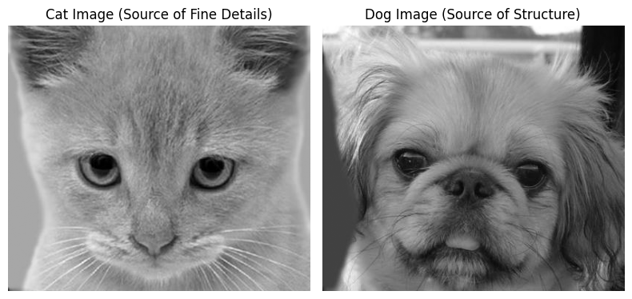

  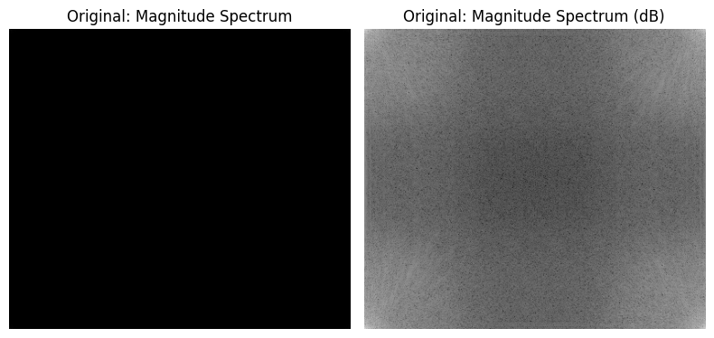

  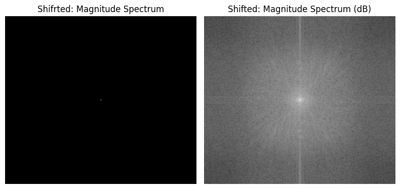

## Square Mask Frequency Mixer (Rejected)

I used a square low-pass and high-pass mask to separate low and high frequencies. However, the sharp cutoff causes ringing artifacts in the final fused image.

- **Formula**: Binary mask in the frequency domain:
  
  $H_{\text{low}}(u, v) =
  \begin{cases}
  1, & \text{if } |u - \frac{M}{2}| \leq r \text{ and } |v - \frac{N}{2}| \leq r \\
  0, & \text{otherwise}
  \end{cases} $
   
  $H_{\text{high}}(u, v) = 1 - H_{\text{low}}(u, v) $
  
  where $r = 30$ pixels.

Low-pass retains central frequencies; high-pass retains outer frequencies.

  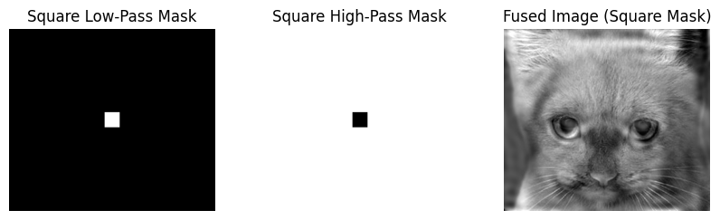

## Circular Mask Frequency Mixer (Rejected)

I used a circular mask to separate frequencies. This improved over the square mask but still caused some ringing and did not yield a clean fusion.

- **Formula**: Circular mask in the frequency domain:
  
  $H_{\text{low}}(u, v) =
  \begin{cases}
  1, & \text{if } \sqrt{\left(u - \frac{M}{2}\right)^2 + \left(v - \frac{N}{2}\right)^2} \leq r \\
  0, & \text{otherwise}
  \end{cases} $
  
  
  $H_{\text{high}}(u, v) = 1 - H_{\text{low}}(u, v)$
  
  where $r = 30$ pixels.

This is Similar to square filters but uses a circular boundary for smoother transitions

  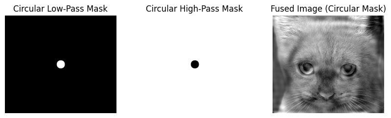

## Bilateral Filter Frequency Mixer (Rejected)

I used a bilateral filter to extract low frequencies (structure) and subtracting a blurred version to get high frequencies (details). Fusion was unstable and did not generalize well.

- **Formula**: Spatial domain filter:
  
  $I_{\text{low}}(x, y) = \frac{1}{W} \sum_{p \in S} I(p) \exp\left(-\frac{\|p - (x, y)\|^2}{2 \sigma_s^2}\right) \exp\left(-\frac{\|I(p) - I(x, y)\|^2}{2 \sigma_c^2}\right)$
  
  $I_{\text{high}}(x, y) = I(x, y) - I_{\text{low}}(x, y)$
  
  where $\sigma_s = 5$, $\sigma_c = 0.15$, $W$ is a normalization factor.

**Logic**: Preserves edges while smoothing , but did not generate best results.

  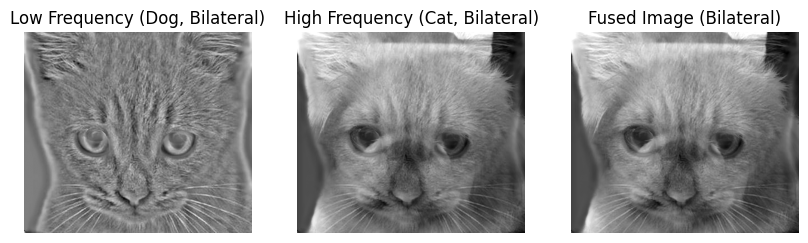

## Gaussian Filter Frequency Mixer (Final Approach)

A Gaussian mask was used for smooth frequency separation, avoiding ringing artifacts and producing a clean hybrid image.

- **Formula**: Spatial domain Gaussian kernel:
  
  $G(x, y) = \frac{1}{\sum G} \exp\left(-\frac{x^2 + y^2}{2 \sigma^2}\right)$
  
- **Logic**: Convolve the dog image with a Gaussian kernel for low frequencies. Subtract a blurred cat image from the original for high frequencies. Sum the results.
- **Reasoning**: Smooth kernel avoids artifacts, providing natural transitions. Tuned $\sigma$ values balance structure and detail.
- **Outcome**: Produces a visually coherent fused image.

  

## Fusion Logic

The frequency mixer combines low frequencies (overall structure) from the dog image with high frequencies (fine details) from the cat image. Low frequencies are extracted by blurring (low-pass filtering), and high frequencies are obtained by subtracting the blurred image from the original (high-pass filtering). The fused image is:

$I_{\text{fused}}$ = $I_{\text{dog, low}}$ + $I_{\text{cat,
high}}$

where $I_{\text{dog, low}}$ is the low-pass filtered dog image, and $I_{\text{cat, high}} = I_{\text{cat}} - I_{\text{cat, low}}$.

## Observations

- **Square and circular masks** cause visible ringing traces due to sharp frequency cut-offs.
- **Bilateral filtering** preserves edges but is sensitive to parameters.
- **Gaussian filtering** provides smooth transitions between frequencies, producing a clean hybrid image.

## Conclusion

The Gaussian filter achieved the best fusion, combining the dog's structure with the cat's details without artifacts. Unsuccessful approaches highlighted the importance of smooth frequency transitions.

# Piccolo Noise Suppression in Music

This notebook has a technique to clean a corrupted audio file containing a song mixed with unwanted instrumental beats. The goal is to analyze the audio, identify the interfering frequencies, design and apply filters to remove these beats, and export a cleaned version of the song after removing the instrumental beats.

## Approach

1. **Load and Normalize Audio**: Reads the WAV file and normalizes it to the range [-1, 1].
2. **Analyze Interference**: Identifies dominant frequencies (e.g., 1453.1 Hz from the spectrogram) and their harmonics using Power Spectral Density (PSD).
3. **Filter Design**: A 6th-order Butterworth band-stop filters (±500 Hz around target frequencies) and visualize their properties.
4. **Apply Filters**: Remove interference with zero-phase filtering.
5. **Visualize Results**: Plotting spectrograms, FFTs, waveforms, filter responses, PSDs, and pole-zero diagrams to validate the process.
6. **Export Cleaned Audio**: Saving the result as a WAV file.

## Key Formulas and Notations
- **Power Spectral Density (PSD)**: Estimates power per frequency using the Welch method:
  
  $P(f) = \frac{1}{N} \left| \sum_{n=0}^{N-1} x[n] e^{-j 2 \pi f n / f_s} \right|^2$
  
  where $ P(f)$  is power at frequency $f$ , $x[n]$ is the signal, $N$ is the number of samples, and  $f_s$ is the sample rate.
- **Fast Fourier Transform (FFT)**: Converts time to frequency domain:
  
  $X[k] = \sum_{n=0}^{N-1} x[n] e^{-j 2 \pi k n / N}$
  
  where $X[k] $ is the frequency spectrum.
- **Band-Stop Filter Transfer Function**: Approximated as:
  
  $H(s) = \frac{1}{1 + \epsilon \left( \frac{s^2 + \omega_1^2}{\omega_0^2} \right)^3}$
  where  $\omega_0$ is the center frequency,  $\omega_1$, $\omega_2$ are cutoffs, and $\epsilon$ controls ripple.
- **Harmonics**: Calculated as $ f_h = k \cdot f_0 $ (where $ k = 1, 2, 3, \ldots $) and ($ f_0 $) is the fundamental frequency).

## Visualizations
- **Spectrogram**: Shows time-frequency energy, highlighting beat removal.
- **FFT Plot**: Displays magnitude vs. frequency, showing interference reduction.
- **Waveform Plot**: Visualizes amplitude over time, comparing raw and cleaned signals.
- **Filter Response**: Plots combined magnitude response ( $|H(f)|$ ) in dB, confirming attenuation.
- **PSD (Filtered)**: Compares power distribution before and after filtering.
- **Pole-Zero Plot**: Maps zeros $(o)$ and poles $(x)$ to ensure filter stability.

###Spectrogram of Corrupted Audio
Here I have plotted a Spectogram. This spectrogram visualizes the audio's frequency content over time. The x-axis is time, the y-axis is frequency (log scale), and colors indicate energy in decibels (dB). Bright areas, especially around 1453.1 Hz, show the unwanted beats, helping us locate the noise for filtering.

  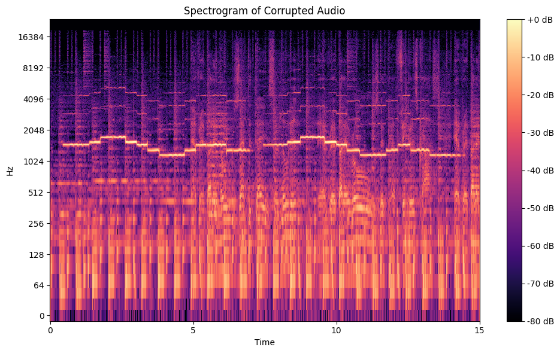

###PSD and Interference Identification
i have plotted the PSD and this Power Spectral Density (PSD) plot displays the power distribution across all the frequencies. The x-axis is frequency in Hz, the y-axis is power on a log scale, and 'x' marks indicate peaks. The dominant peak (around 1453.1 Hz) is the main interference frequency, with harmonics also listed.

  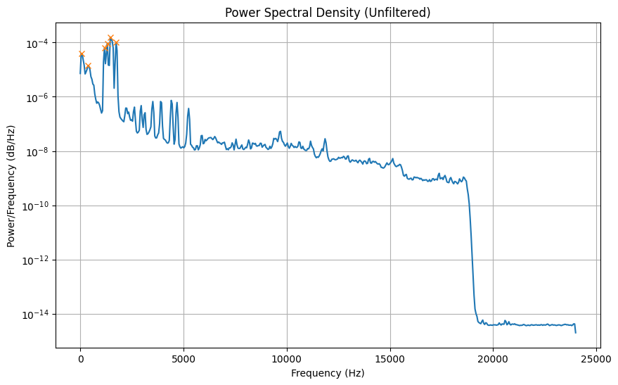

###Bode Plot of Filter
This Bode Plot shows the filter's magnitude response. The x-axis is frequency in Hz (log scale), the y-axis is magnitude in dB, and the red dashed line marks 1453.1 Hz. The dip (e.g., -20 dB) at this frequency confirms the filter will reduce the beats, setting the stage for denoising.

  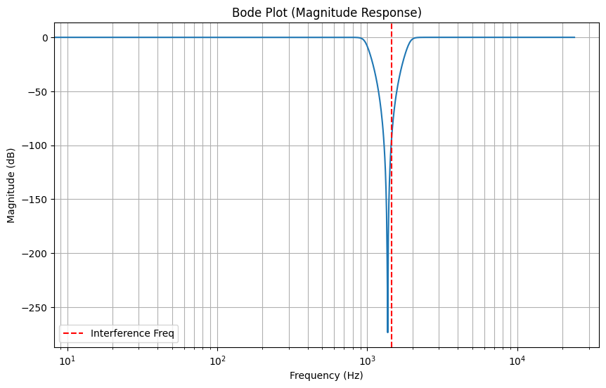

###Pole-Zero Plot
This plot checks the filter's stability. Zeros (circles) near the imaginary axis at interference frequencies enhance blocking, while poles (crosses) inside the unit circle ensure stability. This confirms the filter is safe and effective for audio processing.

  

#Applying Filters and Cleaned Spectrogram
The filter is applied with zero-phase processing to remove beats, and this spectrogram shows the result. The reduced energy at 1453.1 Hz and harmonics indicates successful denoising, though the ±500 Hz range might affect some song frequencies, suggesting a narrower bandwidth could refine it.

  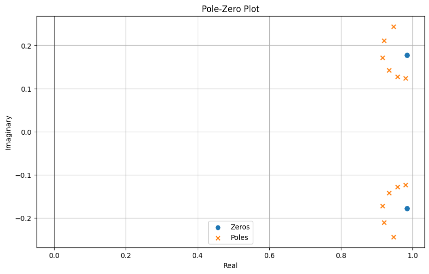

###FFT Comparison
This FFT plot compares frequency content. The unfiltered line has a peak at 1453.1 Hz, while the filtered line shows a reduced peak, confirming beat suppression. The overlap helps assess how much the filter altered the signal, with some residual energy possibly due to the wide bandwidth.

  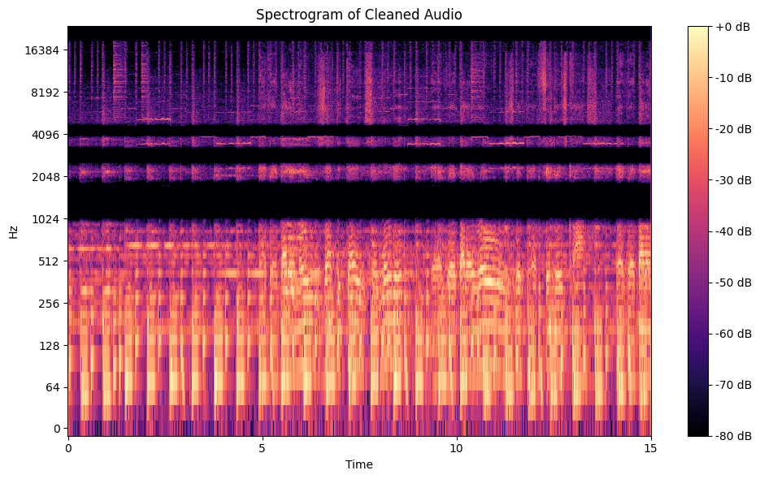

###Waveform Comparison
This plot shows amplitude over time. The unfiltered waveform has spikes from beats, while the filtered version is smoother, indicating noise reduction. The broad ±500 Hz filter might still affect song content, suggesting a narrower range for better preservation.

  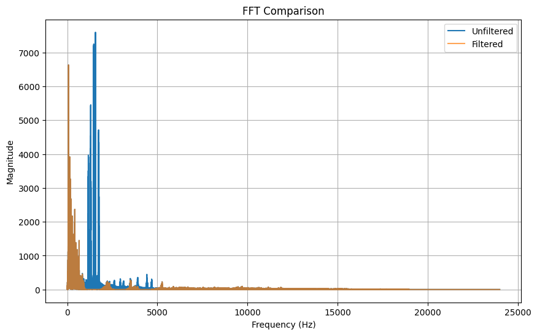

